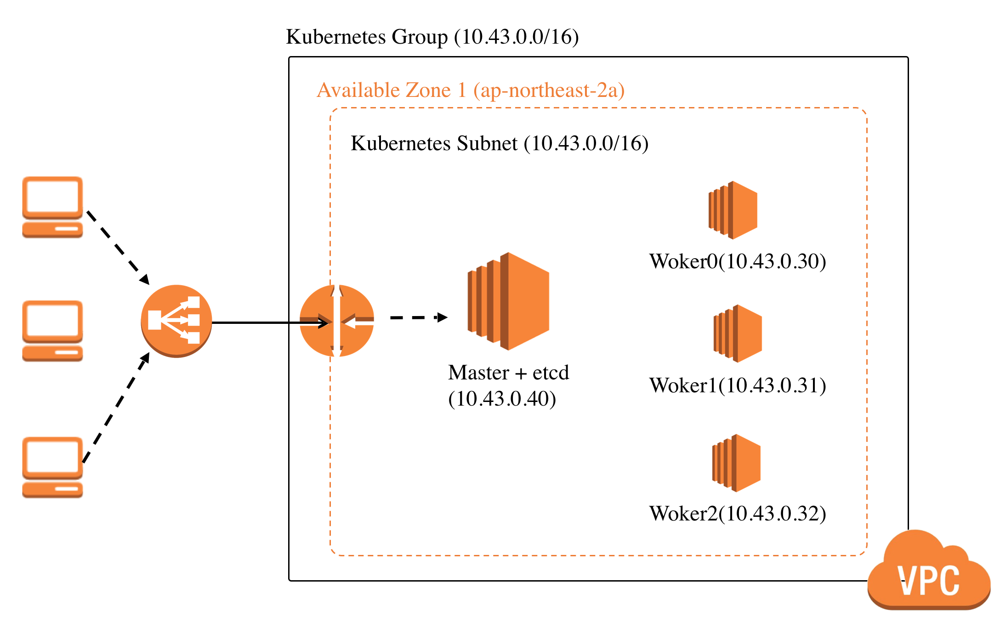

## aws-terraform-kubeAdm

In this repository, you can create kubernetes cluster using only `terraform apply` in AWS.




### 1. Configure on your docker

```bash
$ docker run -it graykode/aws-kubeadm-terraform:0.3 /bin/bash
```

Export your own AWS Access / Secret keys

```bash
$ export AWS_ACCESS_KEY_ID=<Your Access Key in AWS>
$ export AWS_SECRET_ACCESS_KEY=<Your Access Key in Secret>
```

Generate your SSH key pair for aws_key_pair

```bash
$ ssh-keygen -t rsa -N "" -f tf-kube
```

Create your `k8stoken`

```bash
$ python -c 'import random; print "%0x.%0x" % (random.SystemRandom().getrandbits(3*8), random.SystemRandom().getrandbits(8*8))'

> ebd70e.ad84c12d14ee5dae
```


### 2. Create Kubernetes Cluster

Initialize terraform

```bash
$ terraform init 
```

Create all objects in AWS and put k8s token before you created! It's Done.

```bash
$ terraform apply
var.k8stoken
  Enter a value: ebd70e.ad84c12d14ee5dae
```

Check if k8s Cluster is created.

```bash
$ ssh -i tf-kube ubuntu@server-ip
ubuntu@ip-10-43-0-40:~$ kubectl get nodes
NAME                                            STATUS   ROLES    AGE     VERSION
ip-10-43-0-30.ap-northeast-2.compute.internal   Ready    <none>   3m40s   v1.15.0
ip-10-43-0-40.ap-northeast-2.compute.internal   Ready    master   4m4s    v1.15.0
```

If you want to delete all cluster, type this.

```bash
$ terraform destroy
```


#### If you want to see Kubernetes Clustering Step.

```bash
$ tail -f /home/ubuntu/master.log # in master node
$ tail -f /home/ubuntu/worker.log # in worker node
$ tail -f /home/ubuntu/etcd.log # in etcd node
```

### 3. Set [variables.tf](https://github.com/graykode/aws-kubeadm-terraform/blob/master/variables.tf)


1. Set EC2 instance_type
```javascript
variable etcd_instance_type {
  default = "t2.medium"
}
variable controller_instance_type {
  default = "t2.medium"
}
variable worker_instance_type {
  default = "t2.medium"
}
```

2. Set Number of EC2 Node 

```javascript
variable number_of_etcd{
  description = "The number of etcd, only acts as etcd"
  default = 0
}

variable number_of_worker{
  description = "The number of worker nodes"
  default = 1
}
```


#### PS

If you meet `provider.aws: error validating provider credentials` Error, Please check that your IAM key is activate.

#### ToDo
- Set up a High Availability etcd cluster with kubeadm
- Add k8s master node ingress, ingress-controller with ELB

### Author

- Reference : [alicek106/aws-terraform-kubernetes](https://github.com/alicek106/aws-terraform-kubernetes), [cablespaghetti/kubeadm-aws](https://github.com/cablespaghetti/kubeadm-aws)
- Tae Hwan Jung(Jeff Jung) @graykode
- Author Email : [nlkey2022@gmail.com](mailto:nlkey2022@gmail.com)